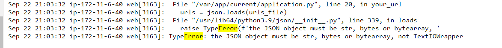

# Automate Build, Test and Deploy URL Shortener Application in Stages

September 22, 2023

By:  Annie V Lam - Kura Labs

# Background

We’re a tech start-up company with a URL shortener tool. We have a SLA with Nike to provide them access to our URL shortener. In the SLA, we are only allowed 20 minutes of downtime a year. If anything happens to the URL shortener, we must communicate any incidents to Nike.

## Incident

A new hire was tasked with updating the URL shortener. The new hire committed version 2 of the application to the main branch. Which automatically triggered a build, test, and deploy to the production server, replacing version 1 of the application running on the server.

## Post-Incident Report
The URL Shortener was giving Internal Server Error with a 500 code.  Since the page was able to launch it is not an Web Server issue.  The issue was with web shortener logic, therefore the issue should be within the application.py file.
We pulled the log file for the Elastic Beansalk production environment and did an error search and the error was pertaining to an error code realated to the wrong json medthod was used.

## Conclusion

**Jenkins**
Jenkins is used to automate the Build, Test, and Deploy the URL Shortner Application.  To use Jenkins in a new EC2, all the proper installs to use Jenkins and to read the programing lanuague that the application is written in needs to be installed. In this case, they are Jenkins, Java, Python, and Jenkins additional plugin "Pipeline Utility Steps".

**Instructions to Setup a New EC2 Instance**

[Create EC2 Instance](https://github.com/LamAnnieV/Create_EC2_Instance/blob/main/Create_EC2_Instance.md)

[Create IAM Roles for Elastic Beanstalk and EC2](https://github.com/LamAnnieV/Setup_AWS/blob/main/Create_AWS_IAM_Roles.md)

**Shell Scripts for Install(s) in the Instance**

[Install "python3.10-venv", "python-pip", "python3-pip" and "unzip"](https://github.com/LamAnnieV/Instance_Installs/blob/main/02_other_installs.sh)

**Instructions for Jenkins Install, Install Plugin(s), and Create Build**

[Jenkins Install](https://github.com/LamAnnieV/Instance_Installs/blob/main/01_jenkins_installs.sh)

[Install "Pipeline Utility Step" Plugin](https://github.com/LamAnnieV/Jenkins/blob/main/Install_Pipeline_Utility_Step_Plugin.md)

[Create Jenkins Multibranch Pipeline Build](https://github.com/LamAnnieV/Jenkins/blob/main/Jenkins_Multibranch_Pipeline_Build.md)

### Jenkins Build #1:  In Jenkins create a build "Deployment_03" for the URL Shortner application from GitHub Repository https://github.com/LamAnnieV/Deployment_03 and run the build.  This build consist of two stages:  Build Stage and Test Stage

  

  

  
